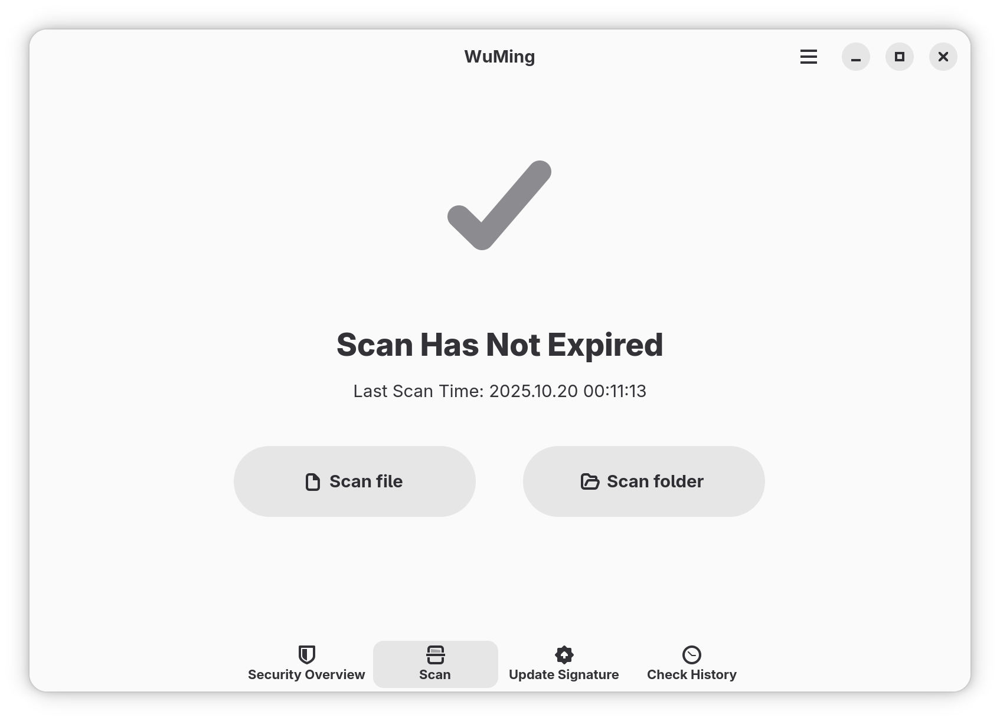
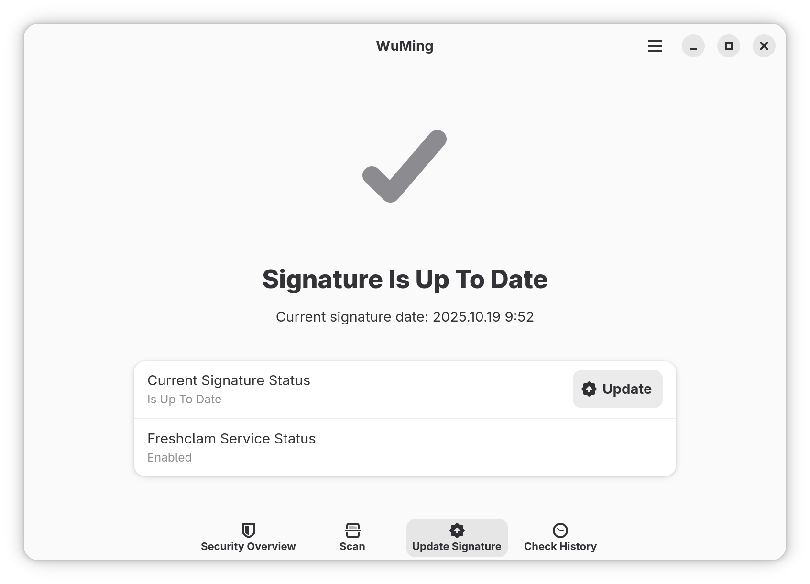
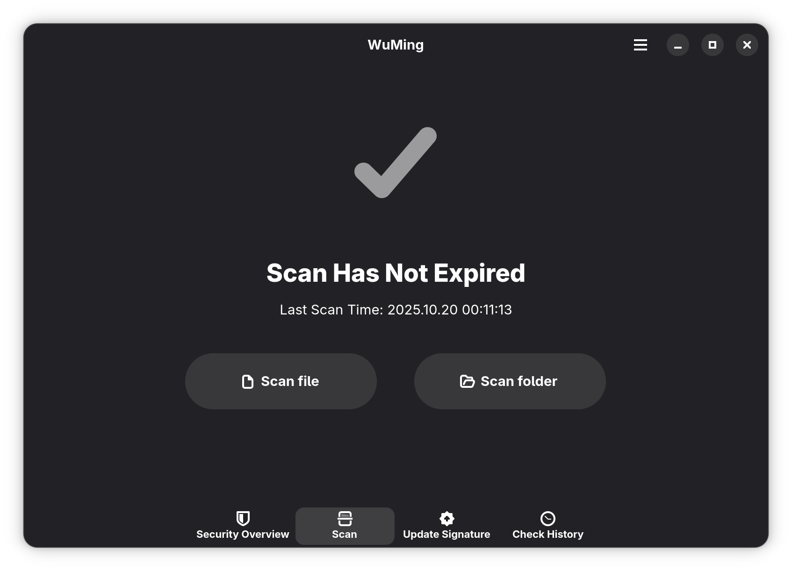

#  WuMing

WuMing (aka. "无名") is a modern, lightweight GUI frontend for ClamAV, designed for Linux users who prioritize control and security.

## Overview

WuMing leverages `clamdscan` to provide fast, efficient, daemon-based malware scanning. It features a clean, responsive user interface built with GTK4 and Libadwaita.

### Design Philosophy: Safety First

At the heart of WuMing is a commitment to user control and safety. **WuMing does NOT auto-quarantine files.** We believe that you should have full authority over your system's files. When threats are detected, WuMing presents you with a clear interface to review the findings and decide for yourself whether to delete or keep each file. This manual-control design empowers users and prevents accidental removal of important system files.

## Features

- **Fast Scanning:** Utilizes `clamdscan` for rapid, daemon-based performance.
- **Modern UI:** Built using Libadwaita for a seamless integration with modern Linux desktops.
- **User-Centric Security:** Manual control over file handling—no automatic quarantining or deletion.
- **Comprehensive Management:** Update ClamAV signatures, scan specific files/directories, and manage threats with ease.

## Screenshots

### Light mode






### Dark mode





## Roadmap

- [x] Update ClamAV signatures
- [x] Scan files and directories
- [x] Take action on infected files (manual control)
- [x] Security overview page
- [x] Settings page
- [x] Scan options customization

## Installation

### Manual Installation

```sh
meson setup build --prefix=/usr && sudo ninja -C build install
```
