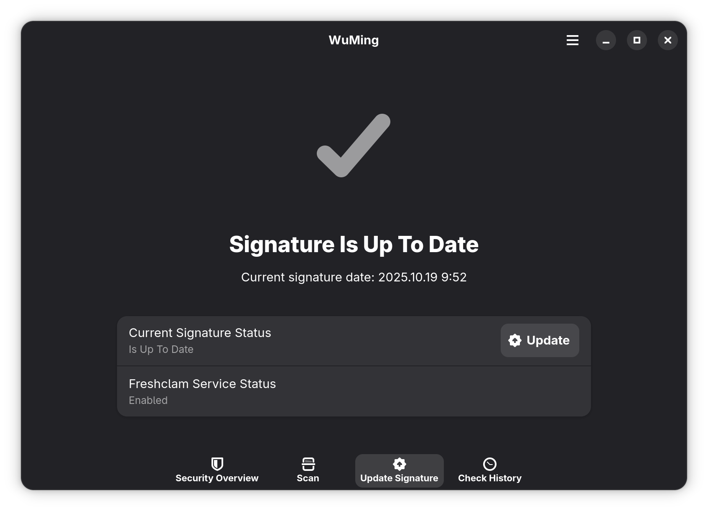

# WuMing

WuMing (aka. "无名") is a simple ClamAV GUI frontend.

> [!WARNING]
> This project is still in its early development. Issue and Pull Requset are welcome.

## Discription

WuMing is a simple ClamAV GUI frontend written in C using GTK4/LibAdwaita. It is designed to be a lightweight, easy-to-use and on-demand malware scanner for Linux systems.

### Features

- Update ClamAV signatures
- Scan files and directories
- Take action on infected files
- View scan history

## Screenshots

### Light mode


### Dark mode




## Roadmap

- [x] Update ClamAV signatures
- [x] scan files and directories
- [x] take action on infected files
- [ ] add secuirty overview page
- [ ] add check history page
- [ ] add settings page
- [ ] allow user to customize scan options (e.g. allow 4GB files, scan archives, etc.)

## Installation

### Arch Linux

Is available in the Arch User Repository (AUR). You can install it using your favorite AUR helper.

```
yay -S wuming
```
